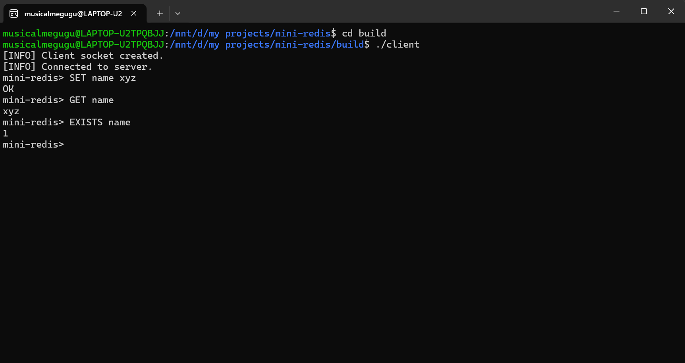
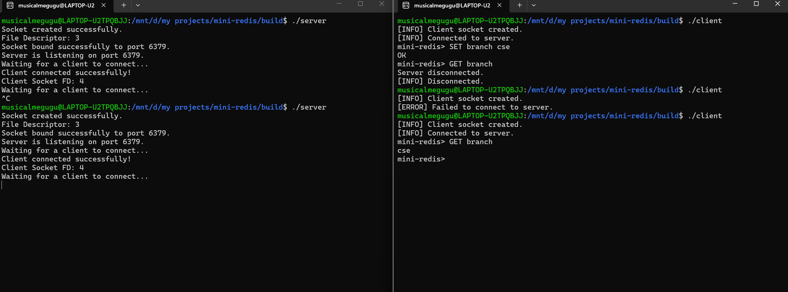

# Mini Redis

A lightweight Redis-inspired in-memory key-value database built from scratch in C++. This project implements the core concepts behind Redis, including TCP networking, multithreading, command parsing, thread-safe data access, and persistence.

The primary goal of this project was to understand how high-performance in-memory databases work by building one from scratch without using external networking libraries.

---

## Features

- TCP client-server architecture using POSIX sockets
- In-memory key-value database
- Thread-safe operations using `std::mutex`
- Supports multiple clients simultaneously using `std::thread`
- Automatic persistence to disk
- Automatic database recovery on server startup
- Custom command parser with input validation
- Modular architecture following separation of concerns
- Built using CMake

---

## Supported Commands

| Command | Description |
|----------|-------------|
| `SET key value` | Store a key-value pair |
| `GET key` | Retrieve the value associated with a key |
| `DEL key` | Delete a key |
| `EXISTS key` | Check if a key exists |

---

## Project Structure

```
MiniRedis/
│
├── src/
│   ├── server/
│   ├── client/
│   ├── parser/
│   ├── executor/
│   └── database/
│
├── build/
├── CMakeLists.txt
├── README.md
├── LICENSE
└── .gitignore
```

---

## Architecture

```
               Client 1
                   │
                   │
             TCP Socket
                   │
               Server
                   │
        receiveMessage()
                   │
              Parser
                   │
              Command
                   │
             Executor
                   │
              Database
         (Protected by Mutex)
                   │
          Persistence Layer
             database.txt
```

---

## Building the Project

Clone the repository

```bash
git clone <your-repository-url>
```

Move into the project

```bash
cd mini-redis
```

Create build directory

```bash
mkdir build
cd build
```

Generate build files

```bash
cmake ..
```

Compile

```bash
make
```

---

## Running

Start the server

```bash
./server
```

In another terminal

```bash
./client
```

---

## Example Session

Client

```
SET name Guransh
OK

GET name
Guransh

EXISTS name
1

DEL name
1

GET name
Key not found
```

---

## Concepts Implemented

### Networking
- TCP sockets
- Socket lifecycle
- bind()
- listen()
- accept()
- send()
- recv()

### Concurrency
- Multithreading
- Detached threads
- Mutex
- Lock Guard (RAII)

### Database
- In-memory key-value store
- Hash table (`unordered_map`)
- Thread-safe access
- Persistence

### Software Design
- Separation of concerns
- Object-oriented design
- Parser / Executor architecture
- Dependency Injection
- CMake build system

---

## Future Improvements

- PING command
- KEYS command
- TTL support
- RESP protocol compatibility
- Logging system
- Benchmarking
- Unit testing

---

## Author

**Nitish Kalra and Guransh Singh**

If you found this project interesting, feel free to star the repository.


## What We Learned

Building this project helped us understand how real-world systems such as Redis work internally. Instead of relying on external libraries, we implemented the networking, command parsing, multithreading, synchronization, and persistence mechanisms from scratch.

Some of the major concepts we explored during this project include:

- TCP client-server communication
- Concurrent request handling using threads
- Thread synchronization with mutexes
- Resource management using RAII
- In-memory database design
- Persistent storage and recovery
- Modular software architecture using C++

This project significantly improved our understanding of systems programming and modern C++.


## Screenshots

### Server


---

### Client



---

### Multiple Clients


---

### Persistence


